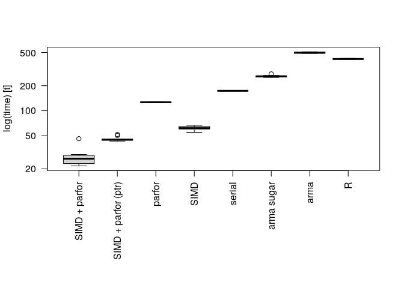

# Rcpp + OpenMP

This repository shows how much speed gains can be obtained from using
[OpenMP](https://openmp.org), and in particular, the `omp simd` and
`parallel for` instructions.

The test consists on computing the pair-wise distances between rows in a
matrix of size `N` by `M`. The equivalent function in R is `dist()`, and
here we redefined it using
[`Rcpp`](https://cran.r-project.org/package=Rcpp) (checkout the
benchmark computing matrix product [here](matrix.md)).

The file [norm.cpp](norm.cpp) contains the C++ source code for the dist
functions. The compiles function are:

  - `dist_omp_simd` Using the pragma directives `parallel for` and
    `simd`.

  - `dist_omp_simd_ptr` Same as above, but instead of creating a copy of
    the input matrix, it uses a `const double *` (a pointer) to access
    the data.

  - `dist_omp` Using the pragma `parallel for`.

  - `dist_simd` Using the pragma `simd`.

  - `dist_for` no directives.

  - `dist_for_arma2` Using Armadillo with vectorized functions.

  - `dist_for_arma1` Armadillo implementation with for-loops.

## Speed benchmark

``` r
# Notice that the -fopenmp flag is already included in the norm.cpp file
Sys.setenv("PKG_CXXFLAGS" = "-O2 -mavx2 -march=core-avx2 -mtune=core-avx2 -DARMA_USE_OPENMP")
Rcpp::sourceCpp("norm.cpp")

library(microbenchmark)
set.seed(718243)
N <- 500
M <- 1000
x <- matrix(runif(N * M), nrow = N)
xt <- t(x)

(ans_bm <- microbenchmark(
  `SIMD + parfor`      = dist_omp_simd(x, N, M, 2),
  `SIMD + parfor (ptr)`= dist_omp_simd_ptr(xt, N, M, 2),
  `parfor`             = dist_omp(x, N, M, 2),
  `SIMD`               = dist_simd(x, N, M),
  `serial`             = dist_for(x, N, M),
  `arma sugar`         = dist_for_arma2(x,N,M),
  `arma`               = dist_for_arma1(x,N,M),
  R                    = as.matrix(dist(x)),
  times                = 10,
  unit                 = "relative"
))
```

    ## Unit: relative
    ##                 expr       min        lq      mean    median        uq
    ##        SIMD + parfor  1.000000  1.000000  1.000000  1.000000  1.000000
    ##  SIMD + parfor (ptr)  1.988231  1.907905  1.643196  1.691858  1.570433
    ##               parfor  5.760479  5.406466  4.534786  4.771680  4.383089
    ##                 SIMD  2.536072  2.604019  2.208521  2.324007  2.217244
    ##               serial  7.952869  7.462539  6.223826  6.547414  5.987260
    ##           arma sugar 11.568625 11.026254  9.320743  9.757749  9.029780
    ##                 arma 22.568619 21.226163 17.889401 18.759475 17.445523
    ##                    R 19.122648 17.966336 15.010903 15.781185 14.479466
    ##        max neval
    ##   1.000000    10
    ##   1.125353    10
    ##   2.791964    10
    ##   1.448714    10
    ##   3.810559    10
    ##   6.013839    10
    ##  11.089759    10
    ##   9.257423    10

As a reference, the elapsed time in ms for R and SIMD + parfor is

    ## Unit: milliseconds
    ##           expr       min        lq      mean    median       uq       max neval
    ##  SIMD + parfor  21.67744  23.12601  27.89102  26.51103  29.0675  46.03553    10
    ##              R 414.53010 415.48960 418.66938 418.37554 420.8819 426.17034    10

Overall, in my machine, the SIMD+parfor combo outperforms all the others
(notice that when it comes to compute matrix products, [Armadillo is the
fastest](matrix.md)). Let’s see if the results are equivalent. At the
very least, we should only observe small differences (if any) b/c of
precision:

``` r
Rcpp::sourceCpp("norm.cpp")
ans0 <- as.matrix(dist(x))
ans_a <- dist_omp_simd(x, N, M)
ans_b <- dist_omp(x, N, M)
ans_c <- dist_simd(x, N, M)
ans_d <- dist_for(x, N, M)
ans_e <- dist_omp_simd_ptr(t(x), N, M)
range(ans0 - ans_b)
```

    ## [1] -1.071123e-07  9.346249e-08

``` r
range(ans_a - ans_b)
```

    ## [1] 0.000000e+00 5.151435e-14

``` r
range(ans_b - ans_c)
```

    ## [1] -9.346248e-08  1.071123e-07

``` r
range(ans_c - ans_d)
```

    ## [1] -2.842171e-14  3.197442e-14

``` r
range(ans_d - ans_e)
```

    ## [1] -3.197442e-14  2.842171e-14

The programs were compiled on a machine with an [Intel(R) Core(TM)
i5-7200U CPU @ 2.50GHz
processor](https://ark.intel.com/content/www/us/en/ark/products/95443/intel-core-i5-7200u-processor-3m-cache-up-to-3-10-ghz.html)
which works with [AVX2
instructions](https://en.wikipedia.org/wiki/Advanced_Vector_Extensions#CPUs_with_AVX2),
i.e. we can literally vectorize 4 double precision operations at a time
(512/64 = 4, on top of multi-threading). One important thing to consider
is that for this to work we had to generate a copy of the R matrix into
a double vector so that elements were contiguous (which is important for
SIMD).

Finally, the
[`microbenchmark`](https://cran.r-project.org/package=microbenchmark) R
package offers a nice viz with boxplot comparing all the methods:

``` r
op <- par(mai = par("mai") * c(2,1,1,1))
boxplot(ans_bm, las = 2, xlab = "")
```

<!-- -->

``` r
par(op)
```

## Session info

The programs were compiled on a machine with an [Intel(R) Core(TM)
i5-7200U CPU @ 2.50GHz
processor](https://ark.intel.com/content/www/us/en/ark/products/95443/intel-core-i5-7200u-processor-3m-cache-up-to-3-10-ghz.html)

``` r
sessionInfo()
```

    ## R version 4.0.2 (2020-06-22)
    ## Platform: x86_64-pc-linux-gnu (64-bit)
    ## Running under: Ubuntu 18.04.4 LTS
    ## 
    ## Matrix products: default
    ## BLAS:   /usr/lib/x86_64-linux-gnu/atlas/libblas.so.3.10.3
    ## LAPACK: /usr/lib/x86_64-linux-gnu/atlas/liblapack.so.3.10.3
    ## 
    ## locale:
    ##  [1] LC_CTYPE=en_US.UTF-8       LC_NUMERIC=C              
    ##  [3] LC_TIME=en_US.UTF-8        LC_COLLATE=en_US.UTF-8    
    ##  [5] LC_MONETARY=en_US.UTF-8    LC_MESSAGES=en_US.UTF-8   
    ##  [7] LC_PAPER=en_US.UTF-8       LC_NAME=C                 
    ##  [9] LC_ADDRESS=C               LC_TELEPHONE=C            
    ## [11] LC_MEASUREMENT=en_US.UTF-8 LC_IDENTIFICATION=C       
    ## 
    ## attached base packages:
    ## [1] stats     graphics  grDevices utils     datasets  methods   base     
    ## 
    ## other attached packages:
    ## [1] microbenchmark_1.4-7
    ## 
    ## loaded via a namespace (and not attached):
    ##  [1] compiler_4.0.2  magrittr_1.5    tools_4.0.2     htmltools_0.5.0
    ##  [5] yaml_2.2.1      stringi_1.4.6   rmarkdown_2.3   knitr_1.29     
    ##  [9] stringr_1.4.0   xfun_0.15       digest_0.6.25   rlang_0.4.6    
    ## [13] evaluate_0.14
