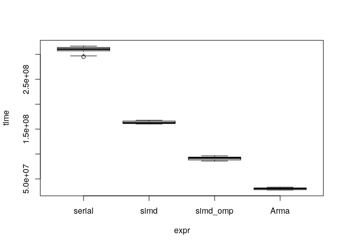

Matrix Multiplication
================

In this benchmark I am measuring how fast can matrix multiplication be
with OpenMP. In particular, the file [matrix.cpp](matrix.cpp) has a
template class representing a matrix in which the data is stored in a
`std::vector` contiguously (column-major).

As in the example of [norm.cpp](README.md), here we compare with/without
SIMD and multithreading. I also included a comparison against
[Armadillo](http://arma.sourceforge.net/) which turned out to be most
efficient that my own implementations (what was I thinking :P).

``` r
# Notice that the -fopenmp flag is already included in the norm.cpp file
# Sys.setenv("PKG_CXXFLAGS" = "-O2 -mavx2 -march=core-avx2 -mtune=core-avx2 -DARMA_USE_OPENMP")
Rcpp::sourceCpp("matrix.cpp")

# Base R implementation
multR <- function(n0, m0, n1, m1) {
  a <- matrix(0.0, nrow = n0, ncol = m0)
  b <- matrix(0.0, nrow = m1, ncol = n1)
  crossprod(a,b)
}

# Comparing with R
dims <- c(100, 4000, 100)
(microbenchmark::microbenchmark(
  R        = multR(dims[1],dims[2],dims[2],dims[3]),
  simd_omp = mult(dims[1],dims[2],dims[2],dims[3], TRUE, 2),
  unit = "ms", times = 10
))
```

    ## Unit: milliseconds
    ##      expr       min        lq      mean    median        uq       max neval
    ##         R 340.44757 342.43687 348.32805 343.64813 346.46325 376.17376    10
    ##  simd_omp  30.67556  31.52095  34.07599  32.76107  35.82931  40.81521    10

``` r
# Pure C++ implementations
dims <- c(100, 10000, 100)
(ans <- microbenchmark::microbenchmark(
  serial   = mult(dims[1],dims[2],dims[2],dims[3], FALSE),
  simd     = mult(dims[1],dims[2],dims[2],dims[3], TRUE, 1),
  simd_omp = mult(dims[1],dims[2],dims[2],dims[3], TRUE, 2),
  Arma     = multArma(dims[1],dims[2],dims[2],dims[3]),
  unit     = "relative",
  times    = 10
))
```

    ## Unit: relative
    ##      expr       min        lq      mean    median       uq      max neval
    ##    serial 10.679616 10.820084 10.196876 10.083447 9.884226 9.450335    10
    ##      simd  5.794787  5.681743  5.403666  5.276371 5.231364 5.010655    10
    ##  simd_omp  3.106995  3.102747  3.023131  2.989794 2.954760 2.876756    10
    ##      Arma  1.000000  1.000000  1.000000  1.000000 1.000000 1.000000    10

``` r
plot(ans)
```

<!-- -->

## Session info

The programs were compiled on a machine with an [Intel(R) Core(TM)
i5-7200U CPU @ 2.50GHz
processor](https://ark.intel.com/content/www/us/en/ark/products/95443/intel-core-i5-7200u-processor-3m-cache-up-to-3-10-ghz.html)

``` r
sessionInfo()
```

    ## R version 4.0.2 (2020-06-22)
    ## Platform: x86_64-pc-linux-gnu (64-bit)
    ## Running under: Ubuntu 18.04.4 LTS
    ## 
    ## Matrix products: default
    ## BLAS:   /usr/lib/x86_64-linux-gnu/atlas/libblas.so.3.10.3
    ## LAPACK: /usr/lib/x86_64-linux-gnu/atlas/liblapack.so.3.10.3
    ## 
    ## locale:
    ##  [1] LC_CTYPE=en_US.UTF-8       LC_NUMERIC=C              
    ##  [3] LC_TIME=en_US.UTF-8        LC_COLLATE=en_US.UTF-8    
    ##  [5] LC_MONETARY=en_US.UTF-8    LC_MESSAGES=en_US.UTF-8   
    ##  [7] LC_PAPER=en_US.UTF-8       LC_NAME=C                 
    ##  [9] LC_ADDRESS=C               LC_TELEPHONE=C            
    ## [11] LC_MEASUREMENT=en_US.UTF-8 LC_IDENTIFICATION=C       
    ## 
    ## attached base packages:
    ## [1] stats     graphics  grDevices utils     datasets  methods   base     
    ## 
    ## loaded via a namespace (and not attached):
    ##  [1] compiler_4.0.2  magrittr_1.5    tools_4.0.2     htmltools_0.5.0
    ##  [5] yaml_2.2.1      stringi_1.4.6   rmarkdown_2.3   knitr_1.29     
    ##  [9] stringr_1.4.0   xfun_0.15       digest_0.6.25   rlang_0.4.6    
    ## [13] evaluate_0.14
